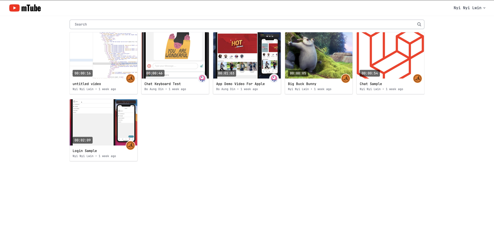
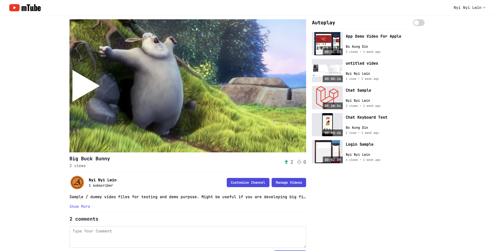
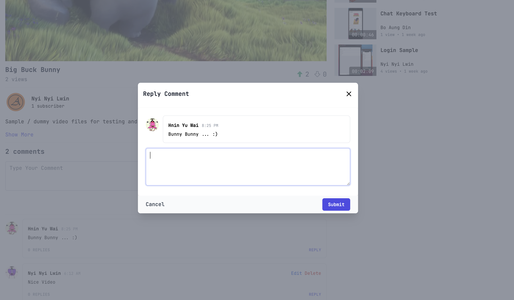
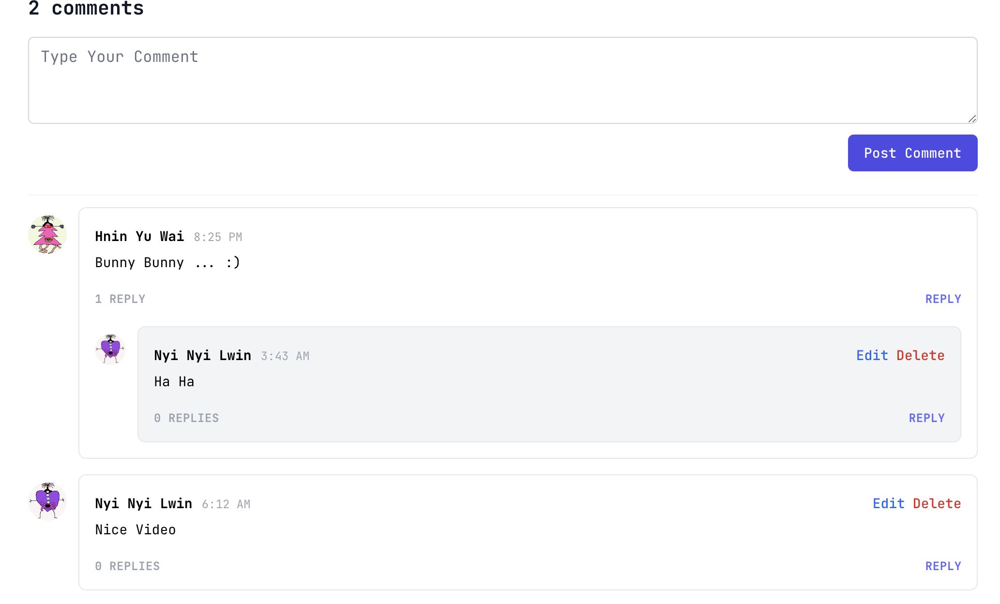
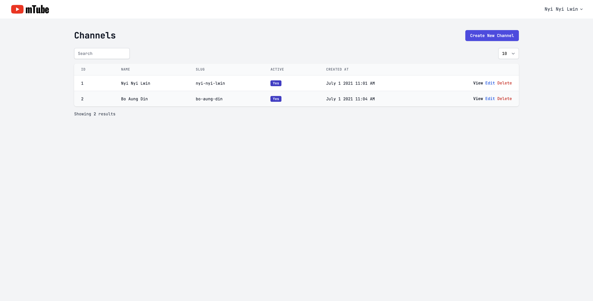
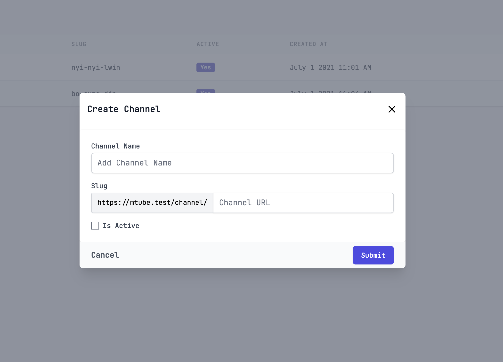
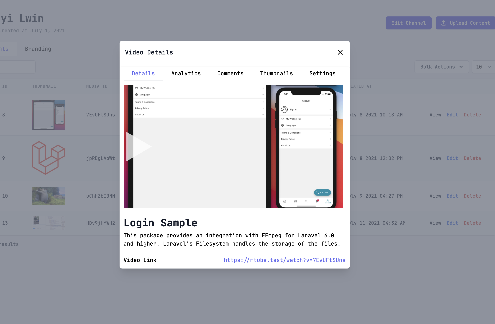
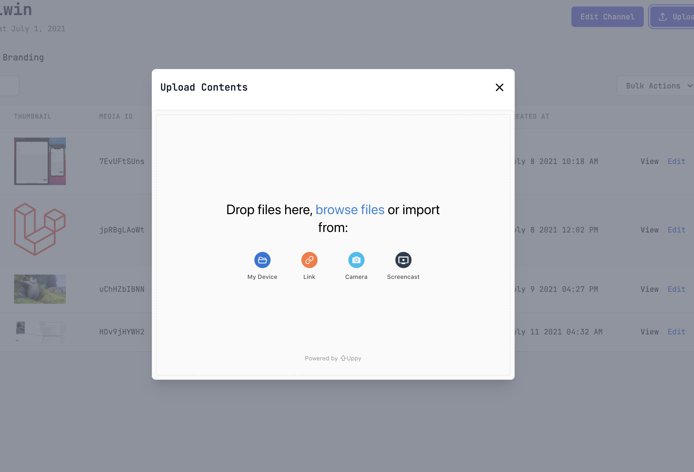

<p align="center">

</p>

## About mTube
mTube is a simple video sharing platform built with Laravel. Create personal channel share videos online with friends and family.

## Packages
- [TusPHP](https://github.com/ankitpokhrel/tus-php)
- [Laravel Websockets](https://github.com/beyondcode/laravel-websockets)
- [Laravel Model Settings](https://github.com/cklmercer/laravel-model-settings)
- [Eloquent Viewable](https://github.com/cyrildewit/eloquent-viewable)
- [Laravel Vote](https://github.com/jcc/laravel-vote)
- [Laravel TALL Preset](https://github.com/laravel-frontend-presets/tall)
- [Livewire Modal](https://github.com/livewire-ui/modal)
- [Livewire](https://github.com/livewire/livewire)
- [Laravel Subscribe](https://github.com/overtrue/laravel-subscribe)
- [Laravel FFMpeg](https://github.com/protonemedia/laravel-ffmpeg)
- [Laravel Readable](https://github.com/Pharaonic/laravel-readable)
- [Laravel Livewire Tables](https://github.com/rappasoft/laravel-livewire-tables)
- [Active for Laravel](https://github.com/dwightwatson/active)
- [Laravel Ban](https://github.com/cybercog/laravel-ban)
- [Laravel Setting](https://github.com/akaunting/laravel-setting)

## Requirements
- FFMpeg
- PHP 7.3/8

## Installations
```
composer install
npm install
```

Edit `.env` file and `config/site.php`


Assuming your app is served from `http://mtube.test` virtual host, then:
``` 
APP_URL=mtube.test

PUSHER_APP_ID=any
PUSHER_APP_KEY=any
PUSHER_APP_SECRET=any
PUSHER_APP_CLUSTER=any

BROADCAST_DRIVER=pusher

MIX_PUSHER_APP_KEY="${PUSHER_APP_KEY}"
MIX_PUSHER_APP_CLUSTER="${PUSHER_APP_CLUSTER}"

LARAVEL_WEBSOCKETS_SSL_LOCAL_CERT=
LARAVEL_WEBSOCKETS_SSL_LOCAL_PK=
LARAVEL_WEBSOCKETS_SSL_PASSPHRASE=

FFMPEG_BINARIES=
FFPROBE_BINARIES=

RTMP_HOST=http://mtube.test:3000
UPPY_COMPANION_URL=http://mtube.test:3020/companion
RTMP_SERVER_URL=rtmp://mtube.test/live
```

You also have to set the host value in `uppy/server.js`

```
server: {
        host: 'mtube.test:3020',
        protocol: 'https',
        path: '/companion',
    },
```

``` 
[
    'converted_file_driver' => 'public',
    'hls_segment_size' => 10,
    'frame_from_seconds' => 3
]
```
Start Laravel Websockets Server, RTMP Server, Uppy Companion Server

```
php artisan key:generate
php artisan storage:link

php artisan websockets:serve
php artisan queue:work

npm run rtmp-server
npm run companion-server
```

## Create Admin User
```
php artisan create:admin
```

## Todo
- [x] ~~Tus Server/Client~~
- [x] ~~Channel Management~~
- [x] ~~Channel Branding~~
- [x] ~~Un/Subscribe Channel~~
- [x] ~~Realtime Un/Subscribe View~~
- [x] ~~Video Management~~
- [x] ~~Transcode Video~~
- [x] ~~Dis/Like Video~~
- [x] ~~Video View Count~~
- [x] ~~Video Comments~~
- [x] ~~Video Thumbnails~~
- [x] ~~Video Settings~~
- [ ] Video Playlists
- [ ] Video Player - Google IMA Pre Roll Plugin
- [x] ~~Realtime Notifications ( Dis/Like, Un/Subscribe Channel, Comments )~~
- [x] ~~Admin Panel~~
- [x] ~~Companion - Uppy Standalone Server~~

## Credits
- All Contributors

## License
The MIT License [MIT license](https://opensource.org/licenses/MIT). Please see License File for more information.

## Screenshots








